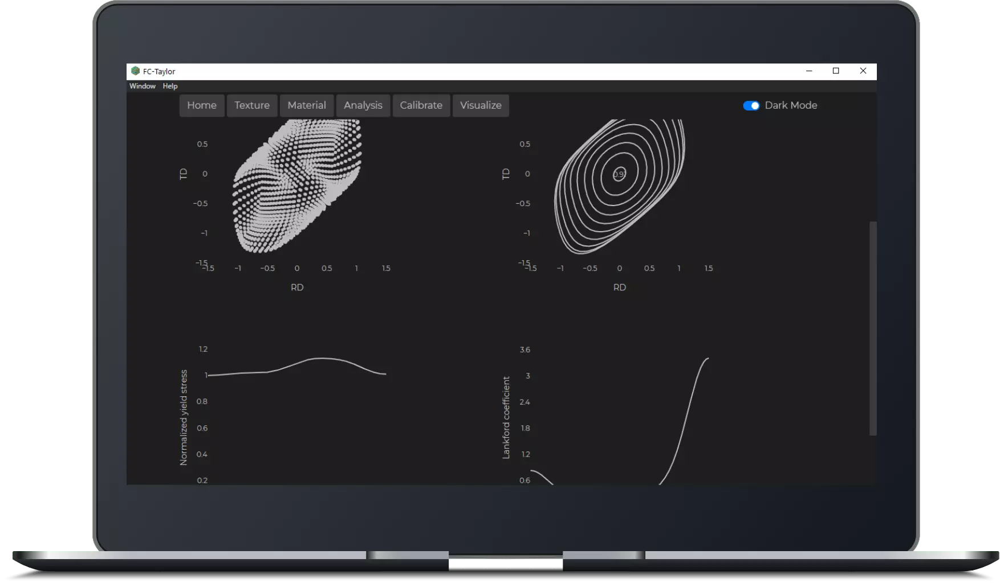

# FC-Taylor Program

A full constraint (FC) Taylor program useful for generating discrete yield surface data from the crystallographic texture of an alloy. The discrete yield surface data can further be used to calibrate the phenomenological Yld2004-18p yield surface with the application. The program uses the hypoelastic implementation in the SIMLab Crystal Mechanics Model ([SCMM-hypo](https://github.com/frodal/SCMM-hypo)) for solving the single crystal response of each individual grain. Download the latest version of the FC-Taylor application [here](https://github.com/frodal/FC-Taylor/releases).

## Usage

See the SCMM-hypo manual or the Home tab of the FC-Taylor application for details.

## Building the Application

To build the FC-Taylor application follow these simple steps.

### Compiling and building for Windows on Windows

1. Clone the project from Github (`git clone --recursive https://github.com/frodal/FC-Taylor.git`)
2. Install [Microsoft Visual Studio](https://visualstudio.microsoft.com/)
3. Install the Intel oneAPI Base and HPC Toolkits including the [Intel Visual Fortran Compiler](https://software.intel.com/en-us/fortran-compilers)
4. Install [Node.js](https://nodejs.org)
5. Install [Python](https://www.python.org)
6. Run the `BuildProjectWindows.bat` script, by double-clicking it or using the command line, to compile, build and package the application for Windows x64

### Compiling and building for Linux on Linux or using the Windows Subsystem for Linux (WSL)

1. Clone the project from Github (`git clone --recursive https://github.com/frodal/FC-Taylor.git`)
2. Install the [Intel oneAPI](https://software.intel.com/content/www/us/en/develop/articles/installing-intel-oneapi-toolkits-via-apt.html) Base and HPC Toolkits including the [Intel Visual Fortran Compiler](https://software.intel.com/en-us/fortran-compilers) (Alternatively install the GNU compilers `sudo apt-get install gfortran gcc g++`)
3. Install the [Node Version Manager](https://github.com/nvm-sh/nvm#install--update-script)
4. Install Node.js (`nvm install node`)
5. Install Python 3 and pip3 (`sudo apt-get install python3 python3-pip`)
6. Run the `BuildProjectLinux.sh` script, by using the command line, to compile and build the application for Linux x64

### Compiling and building for MacOS on MacOS (darwin)

Your on your own, see the Linux build information for tips.

### Update GUI dependencies

* Check which dependencies that have updates available with `npm outdated` using the command line in the `FC-Taylor/GUI` directory
* Update all GUI dependencies by running `npm update` using the command line in the `FC-Taylor/GUI` directory, note that this will not update to an update with a greater major version number
* Update only [Electron](https://electronjs.org/docs/tutorial/first-app#installing-electron) by running `npm install --save-dev electron@latest` using the command line in the `FC-Taylor/GUI` directory
* Update only [Electron-packager](https://github.com/electron-userland/electron-packager) by running `npm install --save-dev electron-packager@latest` using the command line in the `FC-Taylor/GUI` directory
* Update only [Electron-installer-windows](https://github.com/electron-userland/electron-installer-windows) by running `npm install --save-dev electron-installer-windows@latest` using the command line in the `FC-Taylor/GUI` directory
* etc.

See also the [GUIwrapper](https://github.com/frodal/GUIwrapper) repository

## Contributing

To contribute:

1. Fork the Project
2. Create your Feature Branch (`git checkout -b feature/AmazingFeature`)
3. Commit your Changes (`git commit -m 'Add some AmazingFeature'`)
4. Push to the Branch (`git push origin feature/AmazingFeature`)
5. Open a Pull Request

## Contact

Bjørn Håkon Frodal - [@frodal](https://github.com/frodal) - bjorn.h.frodal@ntnu.no
